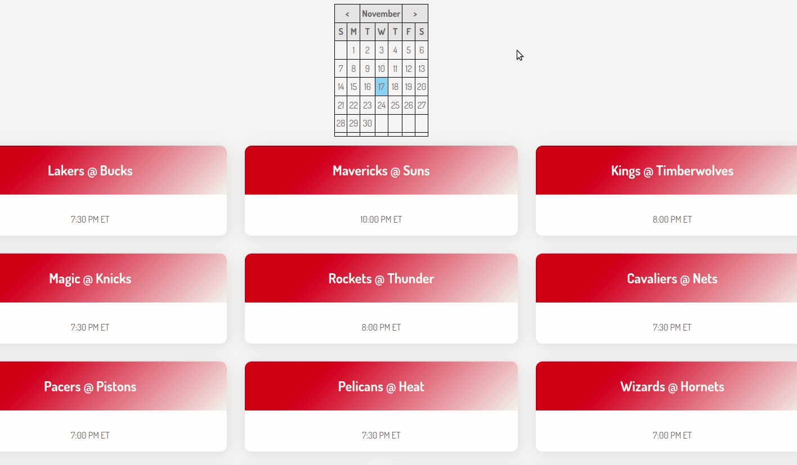

# NBAView

## Description
View NBA games for a given day and their start times.

ESPN has a lot of content and a lot of ads, so the load times are a bit longer
than I would like. 

So, just making a simple JavaScript app to view the games and their start times.



## To Run
Just need the code and a simple server. 
I usually just run a simple python server.

```shell
$ git clone https://github.com/TonyMorse92/NBAView
$ cd NBAView
$ python -m http.server 5000
``` 

Then go to localhost port 5000.
